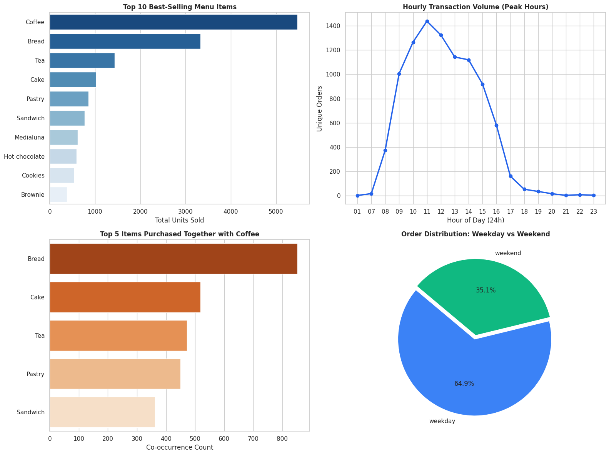

# fnb-pos-sales-analytics
# Coffee & Bakery Point-of-Sale (POS) Analytics & Operations Optimization

## Project Overview
This project evaluates real-world point-of-sale (POS) transactional records from an urban coffee and bakery outlet. The objective is to extract actionable business intelligence regarding product sales concentration, staffing schedules during peak operational windows, menu engineering, and cross-selling product associations.

## Tech Stack
* **Database & Querying:** SQLite3, Advanced SQL (CTEs, Self-Joins, Window Functions, Aggregate Conditionals).
* **Data Processing & Scripting:** Python, Pandas.
* **Data Visualization:** Matplotlib, Seaborn.

## Key Insights & Executive Summary
1. **Sales Concentration (Pareto Principle):**
   * **Coffee** represents **26.68%** of all sold items (5,471 units), followed by **Bread** at **16.21%** (3,325 units). The top 4 products collectively generate more than **54%** of total unit volume.
2. **Operational Peak Demand & Staffing:**
   * Peak transaction windows occur between **10:00 AM and 02:00 PM**, reaching a high at **11:00 AM** (1,439 unique orders).
   * Basket size expands from **1.72 items/order in the early morning (08:00)** to **2.36 items/order in the afternoon (14:00)**.
3. **Market Basket Association (Cross-Selling):**
   * Transactions containing Coffee most frequently pair with **Bread** (852 receipts), **Cake** (518 receipts), and **Pastry** (450 receipts).

## Actionable Recommendations
* **Morning Bundle Packages:** Introduce fixed-price morning bundles (Coffee + Pastry/Bread) prior to 10:00 AM to increase morning basket sizes.
* **Shift Scheduling:** Allocate double barista and cashier capacity during the 10:00-14:00 window to maintain operational throughput.
* **Menu Rationalization:** Decommission or revamp bottom-performing items (50+ items with fewer than 20 total recorded sales) to optimize raw ingredient inventory.
